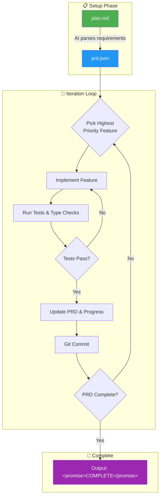

# Ralph Wiggum Loop 🔄

**Bash scripts implementing the Ralph Wiggum technique for iterative, self-referential AI development loops.**

Supports both **Claude CLI** and **OpenAI Codex CLI**.

## What is Ralph?

Ralph is a development methodology based on continuous AI agent loops. As [Geoffrey Huntley](https://ghuntley.com/ralph/) describes it: _"Ralph is a Bash loop"_ - a simple iteration that repeatedly feeds an AI agent a prompt, allowing it to iteratively improve its work until completion.

The technique is named after Ralph Wiggum from The Simpsons, embodying the philosophy of **persistent iteration despite setbacks**.

> [!CAUTION] > **Run in a sandbox environment!** Always use this in a clean repository, isolated environment, or least-privileged directory. Autonomous agents can execute destructive commands. Never run on production systems or directories containing sensitive data.

---

## ⚠️ Safety & Warnings

### Run in a Sandbox

Before running any Ralph loop:

- ✅ Use a **fresh clone** or isolated branch
- ✅ Run in a **container** or virtual environment
- ✅ Use **least-privileged** directories
- ❌ Never run on production systems
- ❌ Never run in directories with sensitive data

### Stop Conditions

Always use **finite iterations** (e.g., `./ralph.sh 10`). Consider adding additional stop conditions:

| Condition                         | Why                                                    |
| --------------------------------- | ------------------------------------------------------ |
| Same test failure repeats N times | Prevent infinite retry loops                           |
| No files changed in an iteration  | Agent may be stuck or confused                         |
| Dangerous command detected        | Block destructive operations unless explicitly allowed |

### Completion Detection

The current approach detects `<promise>COMPLETE</promise>` in stdout. For more robust detection:

- Have the agent write a sentinel file (e.g., `.ralph/DONE`)
- Check for explicit signals in `progress.txt`
- Avoid relying solely on stdout parsing

### Known Edge Cases

- **Multi-line command handling**: Some AI CLI tools have issues with newline handling in command invocation
- **Context window limits**: Very long conversations may cause degraded output quality
- **PRD scope creep**: If agents can modify `prd.json`, they might "complete" by redefining scope

### Ralph vs. PRD Workflow

> [!IMPORTANT] > **Ralph is the loop, not the PRD workflow.** The `plan.md → prd.json → pick feature` pattern in this repo is a scaffold, not intrinsic to Ralph. Geoffrey Huntley's original version is simpler: feed a prompt file to an agent in a loop.

**PRD scope protection:**

- Treat PRD as **product-owner-controlled**
- Agent can propose edits, but you should gate them
- Never let the agent unilaterally redefine requirements

---

## How It Works



## Quick Start

### 1. Create your plan

Edit `plan.md` with your project requirements:

```markdown
# Project: My API

## Features

### High Priority

- [ ] User authentication with JWT
- [ ] Dashboard REST endpoints

### Medium Priority

- [ ] Email notifications

## Constraints

- All tests must pass via `pnpm test`
```

### 2. Run the loop

**For Claude:**

```bash
./claude/ralph.sh 10  # Run 10 iterations
```

**For Codex:**

```bash
./codex/ralph.sh 10  # Run 10 iterations
```

The script will:

1. ✅ Check that `plan.md` exists
2. 📋 Generate `prd.json` from your plan
3. 🚀 Iterate through features automatically
4. 🎉 Exit when PRD is complete

## Installation

Clone this repo into your **project root**:

```bash
cd /your/project/root
git clone https://github.com/rohithgoud30/ralph-wiggum-loop.git plans
```

Your project structure should look like:

```
your-project/
├── plans/                    # Ralph Wiggum Loop (this repo)
│   ├── claude/               # Claude CLI scripts
│   │   ├── ralph.sh          # Multi-iteration loop
│   │   └── ralph-once.sh     # Single iteration
│   ├── codex/                # Codex CLI scripts
│   │   ├── ralph.sh          # Multi-iteration loop
│   │   └── ralph-once.sh     # Single iteration
│   ├── plan.md               # Your requirements
│   ├── example-prd.json      # Reference structure
│   └── example-progress.txt  # Example progress log
├── progress.txt              # Created in PROJECT ROOT
├── src/                      # Your source code
└── ...
```

> **Note:** The `progress.txt` file is created in the **project root** (one level up from plans/), not inside the plans folder. This keeps the progress log alongside your source code.

## Scripts

### Claude (`claude/`)

| Script          | Description                              |
| --------------- | ---------------------------------------- |
| `ralph.sh`      | Multi-iteration loop with PRD generation |
| `ralph-once.sh` | Single iteration only                    |

### Codex (`codex/`)

| Script          | Description                              |
| --------------- | ---------------------------------------- |
| `ralph.sh`      | Multi-iteration loop with PRD generation |
| `ralph-once.sh` | Single iteration only                    |

## Files

| File                   | Location     | Purpose                                         |
| ---------------------- | ------------ | ----------------------------------------------- |
| `plan.md`              | `plans/`     | Your project requirements (edit this!)          |
| `example-prd.json`     | `plans/`     | Reference PRD structure                         |
| `example-progress.txt` | `plans/`     | Example progress log for reference              |
| `prd.json`             | `plans/`     | Generated from plan.md (created by script)      |
| `progress.txt`         | Project root | Log of completed work (created in project root) |

## Prompt Best Practices

### Clear Completion Criteria

❌ **Bad:** "Build a todo API and make it good."

✅ **Good:**

```
Build a REST API for todos.

When complete:
- All CRUD endpoints working
- Input validation in place
- Tests passing
- Output: <promise>COMPLETE</promise>
```

### Incremental Goals

Structure features in phases so the AI can complete them incrementally:

```markdown
### High Priority

- [ ] Phase 1: User authentication (JWT, tests)
- [ ] Phase 2: Product catalog (list/search, tests)

### Medium Priority

- [ ] Phase 3: Shopping cart (add/remove, tests)
```

## Core Principles

The Ralph Wiggum technique is built on specific principles that make autonomous AI agent loops effective.

### 1. Specs Over Steps

Ralph abandons rigid multi-phase plans in favor of a **Product Requirements Document (PRD)** that works like a task board.

| Traditional Approach               | Ralph Approach                            |
| ---------------------------------- | ----------------------------------------- |
| Define _how_ the agent should work | Define _what_ the result should look like |
| Step-by-step instructions          | List of requirements with status flags    |
| You are the architect              | You are the product owner                 |
| Agent follows orders               | Agent picks tasks and solves them         |

The agent looks for the highest-priority incomplete task, implements it, verifies it, marks it done, and exits. The loop then restarts.

### 2. One Thing at a Time

This is the most critical rule. The agent must work on **only one task per loop**.

**Why?**

- AI context windows have limited capacity
- As more information fills the context, quality degrades
- Small, focused tasks leave room for reasoning and error correction
- Large tasks overwhelm the agent and produce poor results

> 💡 **Think of it like a desk:** A clean desk with one document lets you focus. A desk covered in papers makes everything harder.

### 3. No Agent Swarms

**Do NOT** run multiple agents simultaneously on the same project.

| ❌ What NOT to do         | Why it fails                           |
| ------------------------- | -------------------------------------- |
| 16 agents working at once | Merge conflicts become unmanageable    |
| Parallel task execution   | Dependencies between tasks are missed  |
| "Divide and conquer"      | Coordination overhead exceeds benefits |

One agent, one task, one commit. Then repeat.

### 4. Memory Through Logs

Since the agent restarts fresh every loop, it needs external memory.

**The `progress.txt` file acts as the agent's memory:**

- Agent **appends** (never rewrites) learnings after each loop
- Contains notes, warnings, and context for future iterations
- Prevents repeating the same mistakes
- Works like "leaving a note for the next person"

### 5. Git History as Context

Because the agent commits after every single feature:

- Past work is preserved in version history
- Agent can query history to understand previous decisions
- No need to keep everything in active memory
- Clean separation between iterations

### 6. Feedback Loops

Autonomous agents need automated verification since you cannot manually review every step.

**Essential feedback mechanisms:**

- Automated tests catch regressions immediately
- Type checking validates correctness
- Build verification ensures nothing is broken
- If checks fail, agent fixes before committing

Because tasks are small and focused, agents can usually identify and fix errors within the same loop.

---

### The Carpenter Analogy

Imagine building a cabinet:

| Approach                     | Method                                                                                                   | Result                                                                                                     |
| ---------------------------- | -------------------------------------------------------------------------------------------------------- | ---------------------------------------------------------------------------------------------------------- |
| **Multi-agent/Multitasking** | 10 workers hammering nails simultaneously, or one worker cutting, gluing, and staining at once           | Collisions, mess, poor quality                                                                             |
| **Ralph Wiggum**             | One worker cuts one board, checks measurement, writes it down, takes a break, checks notes for next step | Slower in theory, but mistakes caught instantly, workspace stays clean, finished faster with fewer defects |

---

## Philosophy

| Principle                  | Description                                                       |
| -------------------------- | ----------------------------------------------------------------- |
| **Iteration > Perfection** | Don't aim for perfect on first try. Let the loop refine the work. |
| **Failures Are Data**      | Use failures to tune prompts and improve.                         |
| **Persistence Wins**       | Keep trying until success. The loop handles retry logic.          |

## When to Use Ralph

### ✅ Good for:

- Well-defined tasks with clear success criteria
- Tasks requiring iteration and refinement
- Greenfield projects where you can walk away
- Tasks with automatic verification (tests, linters)

### ❌ Not good for:

- Tasks requiring human judgment or design decisions
- One-shot operations
- Tasks with unclear success criteria

## Credits

- **Ralph Technique:** [Geoffrey Huntley](https://ghuntley.com/ralph/)
- **Ralph Orchestrator:** [Mike O'Brien](https://github.com/mikeyobrien/ralph-orchestrator)
- **Inspiration:** [Matt Pocock](https://github.com/mattpocock)

## License

MIT
